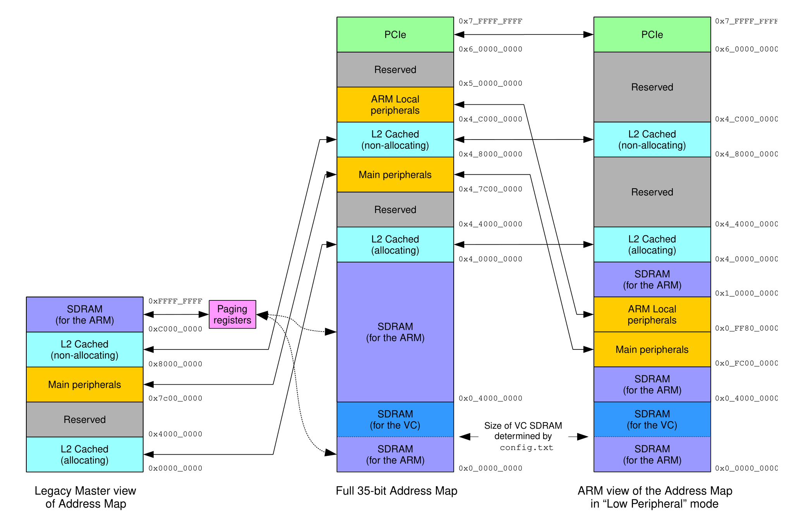

# Memory Structure

- By default the Raspberry Pi 4b is in low peripheral mode.

- 64 bit address size 0xFFFF_FFFF_FFFF_FFFF

- The memory design will be implemented as [Higher Half Kernel](https://wiki.osdev.org/Higher_Half_Kernel).

- Memory translation process starts by locating the address of level 0 table. The address of this table is stored in the ttbr0_el1 register.

- The ASID is stored in one of the two TTBRn_EL1 registers. TTBR0_EL1 is used for user space and TTBR1_EL1 is used for kernel space.

- Will implement multilevel translation
  - Maximum number of tables is 6 for Armv8-A.
  - Levels go from -2 to 3.
  - Kernel will implement 4 levels

- Granule size will be 4KB

/* raspi4b address map
 * SDRAM 0x0_0000_0000 - 0x0_4000_0000
 * Peripherals 0x0_FC00_0000 - 0x1_0000_0000
 * PCIe 0x6_0000_0000 - 0x7_FFFF_FFFF
 */

/* use granule of 4KB.
 * use table indexes from 0 to 3.
 *
 * virtual address bits:
 * 47:39 level 0 table index.
 * 38:30 level 1 table index.
 * 29:21 level 2 table index.
 * 20:12 level 3 table index.
 * 11:0 block offset.
 *
 * each entry in pl0 can point to L1 table.
 * no block entries!
 * pl0 is split as higher half kernel
 *
 * +-------------------+--------------------+----------+---------------------------+
 * | Start             | End                | Size     | Use                       |
 * +-------------------+--------------------+----------+---------------------------+
 * | 0000000000000000  | 0000ffffffffffff   | 256TB    | user                      |
 * | ffff000000000000  | ffff7fffffffffff   | 128TB    | kernel logical memory map |
 * +-------------------+--------------------+----------+---------------------------+
 *
 * translation table lookup with 4KB pages
 * +--------+--------+--------+--------+--------+--------+--------+--------+
 * |63    56|55    48|47    40|39    32|31    24|23    16|15     8|7      0|
 * +--------+--------+--------+--------+--------+--------+--------+--------+
 *  |                 |         |         |         |         |
 *  |                 |         |         |         |         v
 *  |                 |         |         |         |   [11:0]  in-page offset
 *  |                 |         |         |         +-> [20:12] L3 index
 *  |                 |         |         +-----------> [29:21] L2 index
 *  |                 |         +---------------------> [38:30] L1 index
 *  |                 +-------------------------------> [47:39] L0 index
 *  +-------------------------------------------------> [63] TTBR0/1*
 * from linux/Documentation/arch/arm64/memory.rst
 *//* raspi4b address map
 * SDRAM 0x0_0000_0000 - 0x0_4000_0000
 * Peripherals 0x0_FC00_0000 - 0x1_0000_0000
 * PCIe 0x6_0000_0000 - 0x7_FFFF_FFFF
 */

/* use granule of 4KB.
 * use table indexes from 0 to 3.
 *
 * virtual address bits:
 * 47:39 level 0 table index.
 * 38:30 level 1 table index.
 * 29:21 level 2 table index.
 * 20:12 level 3 table index.
 * 11:0 block offset.
 *
 * each entry in pl0 can point to L1 table.
 * no block entries!
 * pl0 is split as higher half kernel
 *
 * +-------------------+--------------------+----------+---------------------------+
 * | Start             | End                | Size     | Use                       |
 * +-------------------+--------------------+----------+---------------------------+
 * | 0000000000000000  | 0000ffffffffffff   | 256TB    | user                      |
 * | ffff000000000000  | ffff7fffffffffff   | 128TB    | kernel logical memory map |
 * +-------------------+--------------------+----------+---------------------------+
 *
 * translation table lookup with 4KB pages
 * +--------+--------+--------+--------+--------+--------+--------+--------+
 * |63    56|55    48|47    40|39    32|31    24|23    16|15     8|7      0|
 * +--------+--------+--------+--------+--------+--------+--------+--------+
 *  |                 |         |         |         |         |
 *  |                 |         |         |         |         v
 *  |                 |         |         |         |   [11:0]  in-page offset
 *  |                 |         |         |         +-> [20:12] L3 index
 *  |                 |         |         +-----------> [29:21] L2 index
 *  |                 |         +---------------------> [38:30] L1 index
 *  |                 +-------------------------------> [47:39] L0 index
 *  +-------------------------------------------------> [63] TTBR0/1*
 * from linux/Documentation/arch/arm64/memory.rst
 */